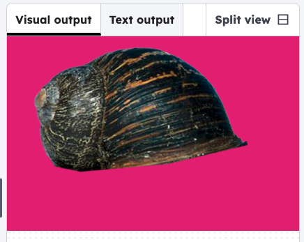

## Choose your background
Edit the values in `background()` to change the colour

### Tip

The three numbers in background(r, g, b) are **r**ed, **g**reen and **b**lue values. All values need to be between 0 and 255.

--- code ---
---
language: python
filename: main.py
line_numbers: true
line_number_start: 1
line_highlights: 7-10
---
from p5 import *

def setup():
    size(600, 400)
    image_mode(CENTER)
    
def draw():
    background(220, 30, 124);

run() # Keep this to run your code
--- /code ---

### Now run your code 
You can see the background in the visual output window. Play with the **RGB** values until you find the background colour you want.

### Debugging

The programme needs `run()` to work. Make sure you have added this to the bottom of the code.

