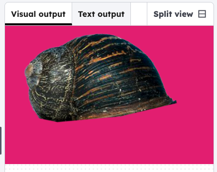

<h2 class="c-project-heading--task">Choose your background</h2>
--- task ---

Edit the values in `background()` to change the colour

--- /task ---

### Tip

The three numbers in background(0, 0, 0) are red, green and blue values. Make sure all your background colour values are between 0 and 255.

--- code ---
---
language: python
filename: main.py
line_numbers: true
line_number_start: 1
line_highlights: 7-10
---
from p5 import *

def setup():
    size(600, 400)
    image_mode(CENTER)
    
def draw():
    background(220, 30, 124);

run() # Keep this to run your code
--- /code ---
--- task ---

Click **run** to see the background in the visual output window.

--- /task ---  

### Debugging

The programme needs `run()` to work. Make sure you have added this ro the bottom of the code.

