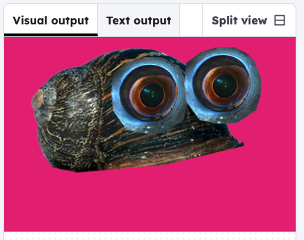

<h2 class="c-project-heading--task">Add the body</h2>
--- task ---

Add an image for the body of the critter.

--- /task ---

--- task ---

Click the image gallery icon to see all the image files in this project. There are different bodies you can use. 

--- /task ---

--- task ---

Add the image file first in the `setup()`. Then show the image in `draw()`

--- /task ---

--- code ---
---
language: python
filename: main.py
line_numbers: true
line_number_start: 3
line_highlights: 7-9, 14-15
---
def setup():
    size(600, 400)
    image_mode(CENTER)
    
    # Add images
    global body
    body = load_image('body1.png')
    
def draw():
    background(220, 30, 124);
    
    # Draw body
    image(body, 275, 150);

run() # Keep this to run your code
--- /code ---
--- task ---

Click **run** to see the body you chose in the visual output.

--- /task ---  

### Tip
Change the file name in `load_image()` to the body you want to use.
 

