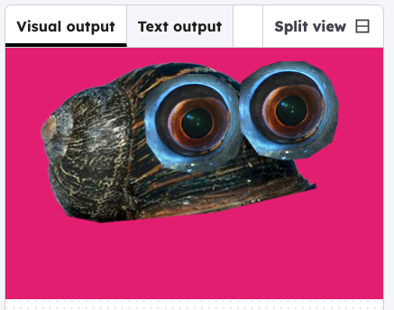

## Give them a leg
Put the first leg on your critter with the code below. 

### Tip

The images are shown in the order of the code, so the leg code is first, as the leg image should be on the bottom layer.

--- code ---
---
language: python
filename: main.py
line_numbers: true
line_number_start: 7
line_highlights: 8, 11, 16-17
---
    # Add images
    global body, eye, leg
    body = load_image('body1.png')
    eye = load_image('eye1.png')
    leg = load_image('leg1.png')
    
def draw():
    background(220, 30, 124)

    # Draw legs
    image(leg, 150, 300)
    
    # Draw body
    image(body, 275, 150)
--- /code ---

### Now run your code 
See a leg appear. You can move the leg by changing the code, or choose a different leg file.

