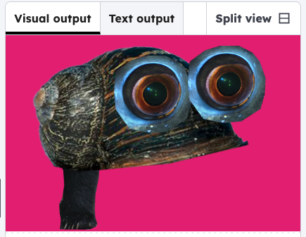

<h2 class="c-project-heading--task">Give them a leg</h2>
--- task ---

Put the first leg in your critter with the code below. 

--- /task ---

### Tip

The images a shown in the order of the code, so the leg code is first, as it is on the bottom layer.

--- code ---
---
language: python
filename: main.py
line_numbers: true
line_number_start: 7
line_highlights: 8, 10, 18-20
---
    # Add images
    global body, eye, leg
    body = load_image('body1.png')
    eye = load_image('eye1.png')
    leg = load_image('leg1.png')
    
def draw():
    background(220, 30, 124);

    # Draw legs
    image(leg, 150, 300);
    
    # Draw body
    image(body, 275, 150);

    # Draw eyes
    image(eye, 300, 120);
    image(eye, 450, 100);

run() # Keep this to run your code
--- /code ---
--- task ---

Click **run** to see the one of your legs. Chose a different leg file, or move it by changing the code.

--- /task ---  

