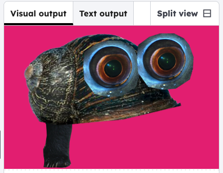

## Loop the legs
To give the critter four legs, use a loop.

## Step 1
**Delete** the `image()` code for the leg, and replace it with the loop below. The loop runs four times, once for each leg.

## Step 2
Experiment with the code: 
- To change the number of legs, edit `range(4)`
- To change the positions of the legs, edit the starting position, `gap`, or the y value

--- code ---
---
language: python
filename: main.py
line_numbers: true
line_number_start: 16
line_highlights: 17-21
---
    # Draw legs
    leg_x = 150 # starting position
    gap = 80 
    for i in range(4):
        image(leg, leg_x, 300)
        leg_x = leg_x + gap
    
    # Draw body
    image(body, 275, 150)
--- /code ---

--- task ---
### Now run your code 
See your finished critter! 

--- /task ---  

### Tip

Instead of a number, `leg_x` is used as the starting position for the legs. It is changed each time the loop runs. `gap` is the number it changes by.

