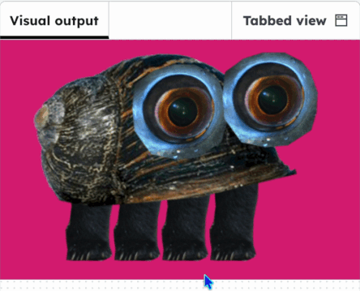

<h2 class="c-project-heading--task">Challenge: dancing critters</h2>
--- task ---

Use `if` to limit how the legs move.

--- /task ---

--- task ---

To make the legs look more attached to the body, decide how high and low you want them to be.

--- /task ---

--- task ---

`print()` the `leg_y` value to see it in the **text output**.

--- /task ---

--- task ---

Use the numbers from the **text output** as the highest or lowest values in your code. 

--- /task ---

--- code ---
---
language: python
filename: main.py
line_numbers: true
line_number_start: 16
line_highlights: 20-28
---
    # Draw legs
    leg_x = 150 # starting position
    gap = 80 
    leg_y = mouse_y
    print(mouse_y)
    
    # Highest
    if leg_y < 200:
        leg_y = 200

    # Lowest    
    if leg_y > 310:
        leg_y = 310

    for i in range(4):
--- /code ---
--- task ---

Click **run** to see the legs ony move to the highest and lowest positions.

--- /task ---  

