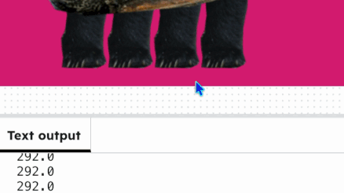

## Challenge: Improve the dancing critter
To make the legs look more attached to the body, decide how high and low you want them to be.

`print()` the `mouse_y` value to see it in the **Text output**.

--- code ---
---
language: python
filename: main.py
line_numbers: true
line_number_start: 16
line_highlights: 20
---
    # Draw legs
    leg_x = 150 # starting position
    gap = 80 
    leg_y = mouse_y
    print(mouse_y)
    
    for i in range(4):
--- /code ---

### Now run your code 
You can use the numbers from the **Text output** as the highest or lowest values in your code. 

